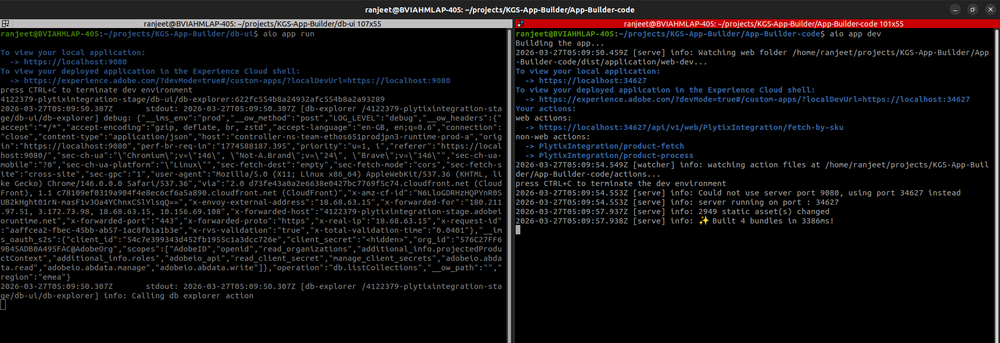

# plytixintegration

Welcome to my Adobe I/O Application!

## Setup

- Populate the `.env` file in the project root and fill it as shown [below](#env)
AIO_DB_REGION=<region>

## Local Dev

- `aio app dev` to start your local Dev server
- App will run on `localhost:9080` by default

To partially deploy, `aio app run` the UI will be served locally but actions will be deployed and served from Adobe I/O Runtime.

For more information on the difference between `aio app run` and `aio app dev`, see [here](https://developer.adobe.com/app-builder/docs/guides/development/#aio-app-dev-vs-aio-app-run)

## Deploy & Cleanup

- `aio app deploy` to build and deploy all actions on Runtime and static files to CDN
- `aio app undeploy` to undeploy the app

## Config

### `.env`

You can generate this file using the command `aio app use`. 

```bash
# This file must **not** be committed to source control

## please provide your Adobe I/O Runtime credentials
# AIO_RUNTIME_AUTH=
# AIO_RUNTIME_NAMESPACE=
```

### `app.config.yaml`

- Main configuration file that defines an application's implementation. 
- More information on this file, application configuration, and extension configuration 
  can be found [here](https://developer.adobe.com/app-builder/docs/guides/configuration/#appconfigyaml)

#### Action Dependencies

- You have two options to resolve your actions' dependencies:

  1. **Packaged action file**: Add your action's dependencies to the root
   `package.json` and install them using `npm install`. Then set the `function`
   field in `app.config.yaml` to point to the **entry file** of your action
   folder. We will use `webpack` to package your code and dependencies into a
   single minified js file. The action will then be deployed as a single file.
   Use this method if you want to reduce the size of your actions.

  2. **Zipped action folder**: In the folder containing the action code add a
     `package.json` with the action's dependencies. Then set the `function`
     field in `app.config.yaml` to point to the **folder** of that action. We will
     install the required dependencies within that directory and zip the folder
     before deploying it as a zipped action. Use this method if you want to keep
     your action's dependencies separated.

## Debugging in VS Code

While running your local server (`aio app dev`), both UI and actions can be debugged. To do so follow the instructions [here](https://developer.adobe.com/app-builder/docs/guides/development/#debugging)

## Typescript support for UI

To use typescript use `.tsx` extension for react components and add a `tsconfig.json` 
and make sure you have the below config added
```
 {
  "compilerOptions": {
      "jsx": "react"
    }
  } 
```
## Note: as of now 27th March 2026, Two application running with aio app dev is not possible because aio app dev runs with live reload server and that conflicts the live reload server ports
- You can run one application with `aio app run` and another with `aio app dev`
